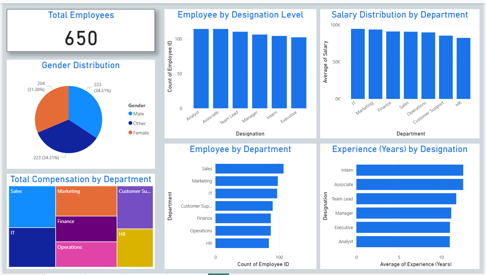
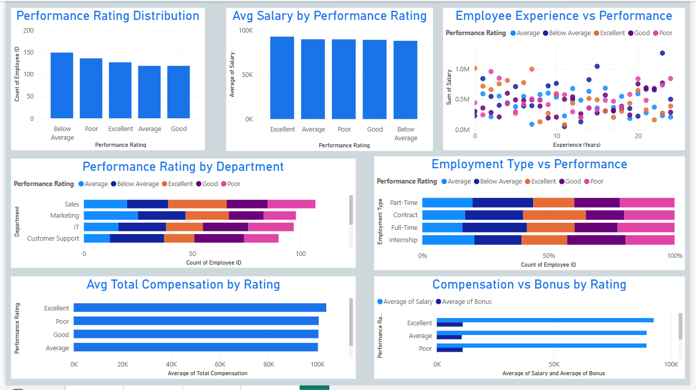
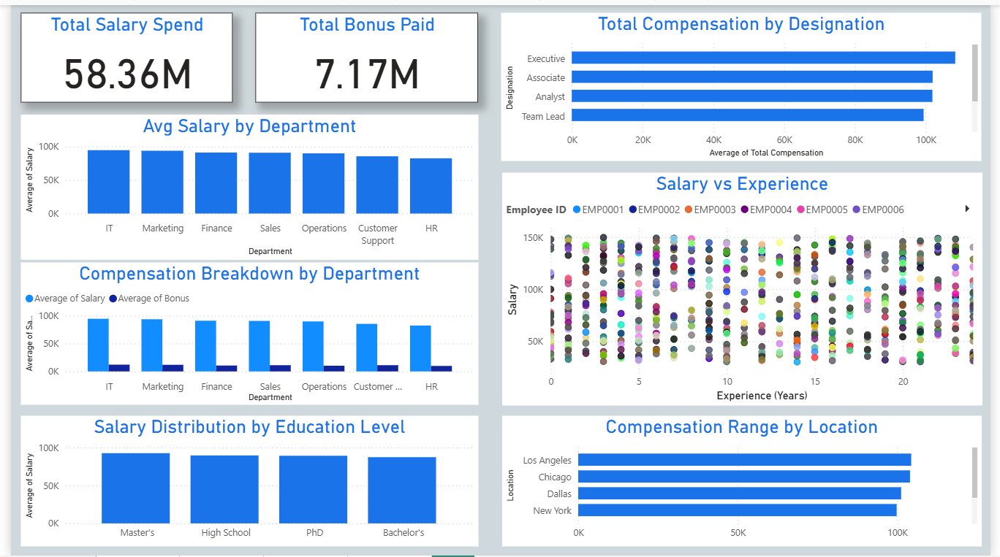

# HR-Analytics-PowerBI-Dashboard
This is an exciting project I had prepared to push my limits in Power BI. 

## Project Overview
This project presents a complete HR Analytics solution built in Power BI using a single HR dataset. It includes interactive dashboards that uncover insights on workforce structure, employee performance, compensation trends, location-based salary differences, and diversity metrics.

## Key Features of the Dashboard
4 fully-interactive Power BI dashboards built from a single HR dataset.

Fast, clean, and easy-to-maintain model

30+ visuals covering performance, compensation, diversity, location insights, and workforce structure.

Drill-down and slicer functionality to analyze employees across roles, departments, and locations.

Compensation analysis including salary, bonus, and total compensation comparison.

Performance analytics with rating patterns and experience-based insights.

Location-based salary and experience trends for strategic HR planning.

Diversity insights across gender, education level, employment type, and department.

Visually consistent colour theme across all dashboards for professional presentation.

## ⭐ Storytelling From Insights

This HR Analytics project uncovers how people, performance, and compensation drive organizational success. The data shows that employee distribution is uneven across departments, with certain teams carrying a higher workload while others remain underutilized. Performance ratings reveal clear patterns—experienced employees consistently deliver better outcomes, but compensation is not always aligned with either performance or tenure.

Location-based analysis exposes significant salary and compensation differences across regions, suggesting that cost-of-living or talent availability may be influencing pay structures. High-performing locations also show stronger retention, while locations with lower performance ratings tend to have higher salary variance.

Diversity insights highlight gaps in gender balance and educational background across teams, pointing toward opportunities to build a more inclusive workforce. Overall, the dashboards tell a story of an organization that is growing but needs strategic alignment in compensation fairness, talent distribution, and performance management to improve productivity and employee satisfaction.

## Key Learnings
Built a complete end-to-end BI solution using a single dataset, improving model efficiency and performance.

Understood HR metrics deeply, including workforce distribution, performance patterns, compensation structures, and diversity trends.

Designed 4 interactive dashboards with 30+ visuals, strengthening storytelling and UI/UX design skills in Power BI.

Improved skills in data cleaning, modeling, and visualization, focusing on simplicity and clarity instead of complex calculations.

Learned how to identify actionable HR insights, such as pay gaps, performance imbalance, experience trends, and location-based salary differences.

Developed strong analytical thinking, connecting HR data to real business scenarios like retention, hiring, pay fairness, and productivity.

Enhanced communication skills, presenting insights visually and narratively for HR, leadership, and business stakeholders.

## Sample Dashboards

[]&nbsp;

[]&nbsp;

[]&nbsp;

